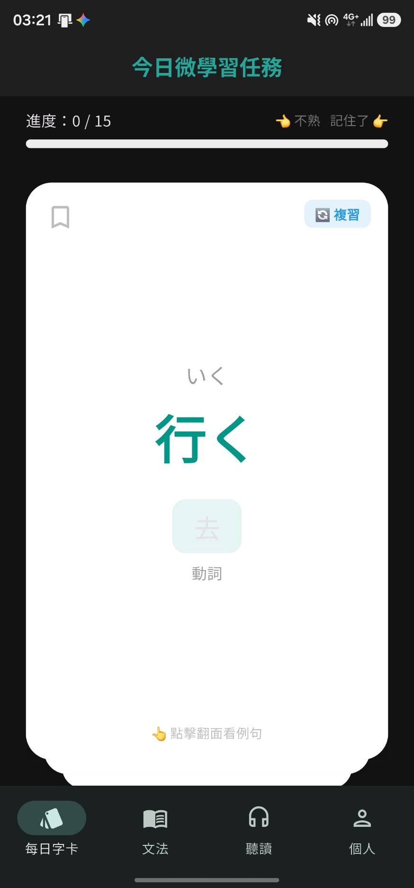
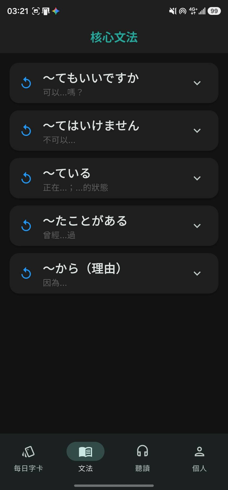
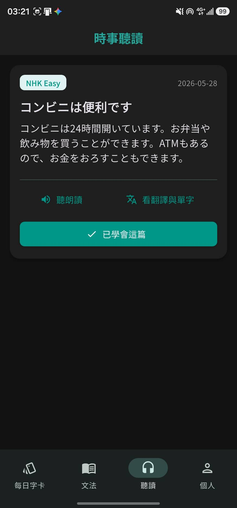
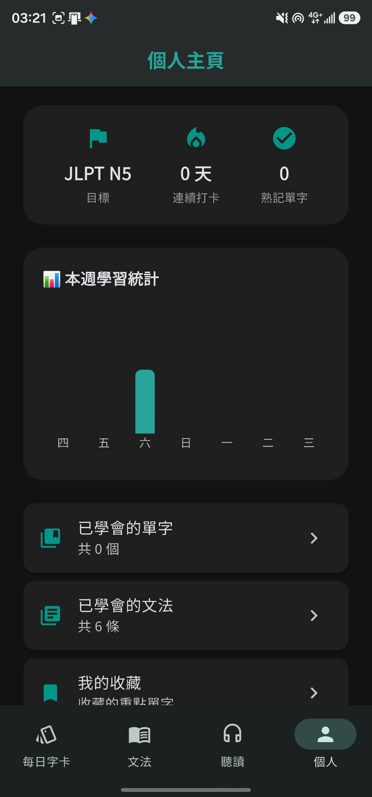

# JLPT Micro Mobile Learning APP

A mobile microlearning application for Japanese learners, built with **Flutter** and **Supabase**.

JLPT Micro combines vocabulary, grammar, reading, spaced repetition, and learning progress tracking into a lightweight daily learning experience. The project was developed as a mobile learning course project and explores how **microlearning** and **spaced repetition** can be integrated into a cross-platform application.

---

## App Screenshots

Actual application screenshots showing the four main learning areas in dark mode, with a Traditional Chinese interface and Japanese learning content.

| Daily Vocabulary | Grammar Learning |
| :---: | :---: |
|  |  |
| Review Japanese vocabulary with flashcards and track daily task progress. | Browse core grammar patterns and their Chinese meanings. |

| Reading & Listening | Learning Dashboard |
| :---: | :---: |
|  |  |
| Read short Japanese articles with narration and translation controls. | View the JLPT target, learning streak, weekly activity, and learned items. |

---

## Project Overview

Traditional language-learning applications often contain large amounts of learning material, which can make it difficult for learners to maintain a consistent study routine.

**JLPT Micro** is designed around the concept of **short and repeatable daily learning sessions**. Users can select a target JLPT level and complete daily vocabulary, grammar, and reading tasks while the application records their progress in the cloud.

The system also applies a simplified **SM-2 spaced repetition algorithm** to vocabulary review. Based on the learner's response, the system dynamically determines when a word should appear again.

---

## Features

### Daily Vocabulary Learning

* Swipe-based flashcard interface
* Separate **new words** and **review words**
* Tap cards to view example sentences and translations
* Swipe right for remembered words and left for unfamiliar words
* Automatic review scheduling using an **SM-2 based spaced repetition algorithm**
* Vocabulary familiarity and review interval tracking
* Bookmark important vocabulary
* Continue learning with additional cards after completing the daily task

### Grammar Learning

* Daily grammar learning and review
* Grammar explanations and example sentences
* Learning progress tracking
* Japanese pronunciation using **Text-to-Speech (TTS)**
* Separation between new grammar points and review items

### Reading & Listening Practice

* Japanese news-style reading materials
* Japanese **Text-to-Speech** playback
* Chinese translation and key vocabulary support
* Add useful vocabulary from reading materials into the vocabulary learning system
* Track completed reading materials

### Learning Dashboard

* JLPT target level configuration
* Consecutive learning-day streak
* Mastered vocabulary count
* Mastered grammar count
* Recent **7-day learning statistics**
* Visualized learning data using charts

### Additional Learning Features

* Vocabulary bookmarks
* Mastered vocabulary collection
* Mastered grammar collection
* Quiz system
* Achievement / badge system
* Daily learning records

### User System

* Email and password registration
* User login / logout
* Password reset
* Persistent login session
* Cloud synchronization of learning progress
* Per-user data isolation with **Row Level Security (RLS)**

### User Experience

* First-time onboarding flow
* Loading skeleton animations
* Light / Dark mode following system settings
* Responsive Flutter Material UI
* Local settings cache for improved usability

---

## Spaced Repetition

Vocabulary learning is managed using an **SM-2 inspired spaced repetition mechanism**.

Each vocabulary item stores information such as:

* Familiarity
* Ease factor
* Review interval
* Next review date
* Number of appearances
* Number of correct responses

When a learner remembers a word, its review interval gradually increases.

When a learner marks a word as unfamiliar, its familiarity level is reset and the word is scheduled to appear again sooner.

This allows JLPT Micro to provide a more personalized learning sequence instead of displaying vocabulary in a fixed order.

---

## System Architecture

```text
┌──────────────────────────────┐
│        Flutter Client        │
│        Dart / Material UI    │
└──────────────┬───────────────┘
               │
               │ supabase_flutter
               ▼
┌──────────────────────────────┐
│           Supabase           │
│                              │
│  Authentication             │
│  Data API                   │
│  Row Level Security (RLS)   │
└──────────────┬───────────────┘
               │
               ▼
┌──────────────────────────────┐
│      PostgreSQL Database     │
│                              │
│  Vocabulary / Grammar       │
│  Learning Progress          │
│  Reading Progress           │
│  Daily Sessions             │
│  User Profiles              │
└──────────────────────────────┘
```

The application does not require a separately maintained application server. Flutter communicates with Supabase through the official Flutter client, while authentication, database access, and access control are handled through Supabase.

---

## Tech Stack

| Category              | Technology                          |
| --------------------- | ----------------------------------- |
| Frontend              | Flutter                             |
| Programming Language  | Dart                                |
| UI Framework          | Flutter Material                    |
| Backend Service       | Supabase                            |
| Authentication        | Supabase Auth                       |
| Database              | PostgreSQL                          |
| Database Language     | SQL                                 |
| Security              | PostgreSQL Row Level Security (RLS) |
| Cloud Client          | `supabase_flutter`                  |
| Local Storage         | `shared_preferences`                |
| Text-to-Speech        | `flutter_tts`                       |
| Data Visualization    | `fl_chart`                          |
| Flashcard Interaction | `flutter_card_swiper`               |
| Loading UI            | `shimmer`                           |
| Japanese Font         | `google_fonts`                      |

---

## Database Design

The Supabase database contains the following main tables:

| Table                   | Purpose                                                |
| ----------------------- | ------------------------------------------------------ |
| `vocabulary_bank`       | Vocabulary content                                     |
| `user_word_progress`    | User vocabulary learning and SRS progress              |
| `grammars`              | Grammar learning content                               |
| `user_grammar_progress` | User grammar learning progress                         |
| `news`                  | Reading materials                                      |
| `news_vocab`            | Important vocabulary associated with reading materials |
| `user_news_progress`    | User reading progress                                  |
| `daily_sessions`        | Daily learning activity records                        |
| `user_profiles`         | User settings and target JLPT level                    |

User-specific records are protected using **Row Level Security**, ensuring that authenticated users can only access their own learning data.

---

## Project Structure

```text
jlpt_micro/
├── lib/
│   ├── main.dart
│   ├── models/              # Application data models
│   ├── screens/             # UI pages
│   │   ├── auth/
│   │   ├── onboarding/
│   │   ├── splash/
│   │   ├── home/
│   │   ├── grammar/
│   │   ├── reading/
│   │   ├── profile/
│   │   ├── mastered/
│   │   ├── quiz/
│   │   └── achievements/
│   ├── services/            # Supabase and learning logic
│   └── utils/               # Theme and reusable utilities
│
├── android/
├── ios/
├── web/
├── windows/
├── macos/
├── linux/
│
├── supabase_setup.sql
├── supabase_advanced.sql
├── supabase_fixes.sql
├── supabase_seed_batch2.sql
├── supabase_seed_batch3.sql
├── REQUIREMENTS.md
└── pubspec.yaml
```

The application separates **UI, data models, and service logic**, making the project easier to maintain and extend.

---

## Getting Started

### Requirements

* Flutter SDK `>= 3.41.x`
* Dart SDK `>= 3.11.4`
* JDK 17+
* Supabase account

### 1. Clone the repository

```bash
git clone https://github.com/BlankTsai/jlpt_micro.git
cd jlpt_micro
```

### 2. Install dependencies

```bash
flutter pub get
```

### 3. Configure Supabase

Create the local secrets file:

```bash
cp lib/secrets.example.dart lib/secrets.dart
```

Then configure:

```dart
const supabaseUrl = 'YOUR_SUPABASE_URL';
const supabaseAnonKey = 'YOUR_SUPABASE_ANON_KEY';
```

### 4. Initialize the database

Run the SQL scripts in the Supabase SQL Editor according to the setup instructions in `REQUIREMENTS.md`.

### 5. Run the application

```bash
flutter run
```

To build an Android APK:

```bash
flutter build apk --release
```

---

## Security

* Supabase credentials are separated from the source code through `secrets.dart`
* Secret configuration files are excluded from Git
* User authentication is handled by **Supabase Auth**
* User learning records are protected using **Row Level Security**
* User passwords are never stored directly by the Flutter client

---

## What I Learned

Through this project, I practiced building a complete mobile application from UI design to cloud data persistence, including:

* Cross-platform application development with Flutter
* Dart asynchronous programming
* Relational database design
* SQL and data modeling
* User authentication
* Cloud database integration
* Row-level access control
* Separation of UI and service logic
* User learning-progress modeling
* Implementation of a spaced repetition algorithm
* Learning-data visualization
* Mobile interaction and user-experience design

More importantly, the project allowed me to combine **software engineering with digital learning design**, transforming the concept of microlearning into an actual working system.

---

## Current Development Status

The core learning workflow, authentication, learning progress tracking, spaced repetition, reading practice, statistics, quiz, and achievement systems have been implemented.

The application supports selecting JLPT levels from **N5 to N1**, while the current bundled learning dataset primarily focuses on selected levels such as **N5 and N3**.

Future extensions may include:

* Expanding the JLPT vocabulary and grammar dataset
* Improving the spaced-repetition model
* Adding more detailed learning analytics
* Expanding automated testing
* Improving cross-platform UI adaptation
* Introducing personalized learning recommendations

---

## Author

**BlankTsai**

National Taiwan Normal University

GitHub: [BlankTsai](https://github.com/BlankTsai)
